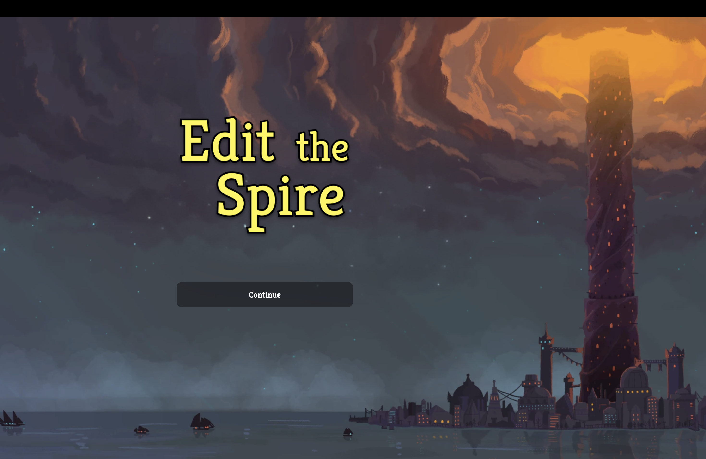
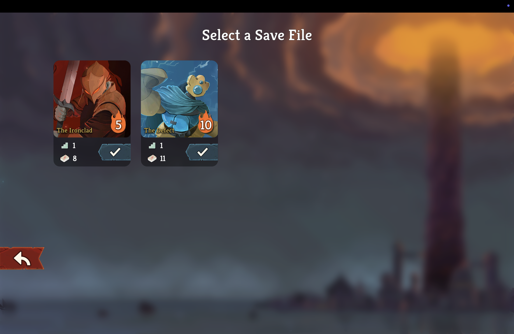
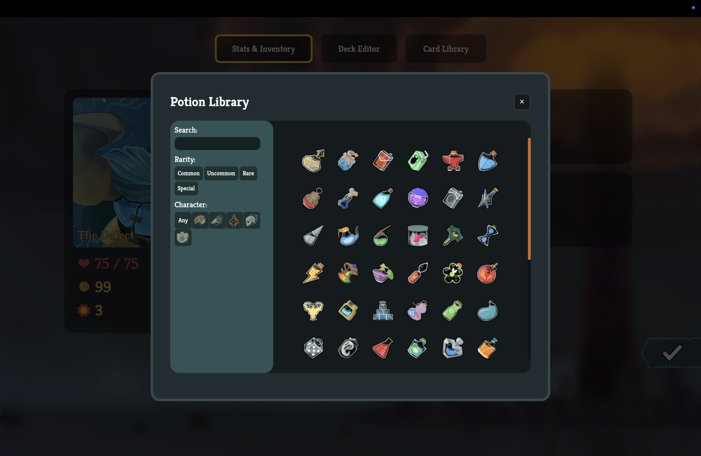

# Edit The Spire

Edit The Spire is a desktop save editor for **Slay the Spire 2**. It is built with [Tauri](https://v2.tauri.app/), TypeScript, and Vite.

## Screenshots

<p align="center">
  
</p>


<p align="center">
  
  
</p>

## Download

Pre-built releases are available for Windows, macOS, and Linux on the [Releases page](https://github.com/ndarwin314/Edit-The-Spire/releases).

### Windows

Download the Windows installer (`.exe`) from the latest release.

### macOS

Download the macOS disk image (`.dmg`) from the latest release.

### Linux

Download the AppImage (`.AppImage`) or Debian package (`.deb`) from the latest release.

## Building from Source

### Prerequisites

You will need:

* [Node.js](https://nodejs.org/) (LTS)
* [pnpm](https://pnpm.io/)
* [Rust](https://www.rust-lang.org/tools/install)
* The platform-specific dependencies required by Tauri

See the [Tauri prerequisites](https://v2.tauri.app/start/prerequisites/) for platform-specific setup instructions.

### Clone the repository

```bash
git clone https://github.com/ndarwin314/Edit-The-Spire.git
cd Edit-The-Spire
```

### Install dependencies

```bash
pnpm install
```

### Run in development

```bash
pnpm tauri dev
```

### Build the application

```bash
pnpm tauri build
```

The resulting application bundles and installers will be placed in:

```text
src-tauri/target/release/bundle/
```

## Tech Stack

* [Tauri 2](https://v2.tauri.app/)
* TypeScript
* Vite
* Rust
* pnpm
